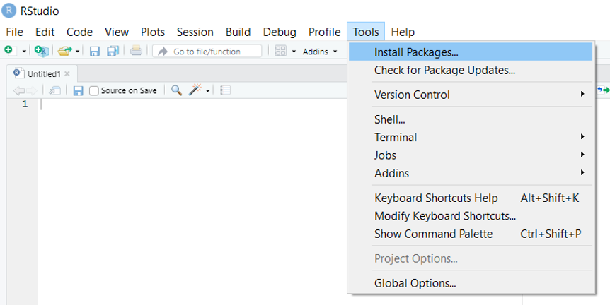

Este taller ha sido desarrollado por:

- <a href="https://www.edslab.org/" target="_blank">**Prof. Melissa Guzmán**</a> (University of Southern California).

- Juan Zuloaga director de ( <a href="https://www.ecodiversatropical.com/" target="_blank">Ecodiversa Tropical</a>).


```{r setup, include=FALSE}
knitr::opts_chunk$set(echo = TRUE)
knitr::opts_knit$set(root.dir = "C:/Talleres_R/IntroR_Bases/")
```
___

# 1. Objetivos de Aprendizaje

Al final de este taller usted podrá saber cómo:

- Usar R como calculadora
- Identificar y usar varios tipos de datos (ej: numéricos, caracteres)
- Crear un objeto y asignar valores al objeto
- Identificar y crear estructuras de datos (ej: vectores, hoja de datos (o data frames en inglés), listas y matrices)
- Aplicar funciones básicas matemáticas y estadísticas
- Enteder qué son funciones y paquetes en R
- Saber utilizar las ayudas en R


# 2. Para empezar 

## ¿Qué es R y RStudio?

<a href="https://www.r-project.org/about.html" target="_blank">R</a> es un lenguaje y un ambiente para el análisis estadístico y la graficación.


<a href="https://en.wikipedia.org/wiki/RStudio" target="_blank">RStudio</a> es un <a href="https://es.wikipedia.org/wiki/Entorno_de_desarrollo_integrado" target="_blank">Entorno de Desarrollo Integrado</a>  (Integrated Development Environment, IDE en inglés) que permite la integración de herramientes diseñadas para ser más productivos e interactivos en R.

Es decir que RStudio le permite al usuario, no solamnete interactuar y ver los códigos en R (que es el lenguaje de programación), sino tambien visualizar gráficas, tablas, archivos, mensajes y ayudas para facilitar el proceso de programación.

R y RStudio son softwares de libre acceso (Open source) que puede ejecutar desde varias plataformas como: Windows, Mac y Linux.

## Instalar R

**Para installar R**:

- Vaya a <a href="https://cran.r-project.org" target="_blank">CRAN</a> (CRAN = The Comprehensive R Archive Network). 

- Seleccione "Download R for Windows" or Download R for macOS, dependiendo de su computador.

- Seleccione el link "install R for the first time", que le permitirá bajar el archivo ejecutable de R (.exe).

- Corra (Run) el archivo R ejecutable (.exe) para empezar la instalación y permita que la aplicación haga cambios en su computador.

- Seleccione el lenguaje de instalación.

- Seleccione "Finish" para salir de la configuración de instalación.


**Para instalar RStudio**:

- Vaya a la página web de <a href="https://posit.co/" target="_blank">RStudio</a>

- Seleccione el link "Download RStudio" en la esquina superior derecha.

- Seleccione "DOWNLOAD RSTUDIO" bajo el  "RStudio Desktop" (usted puede ver que es FREE)

- Seleccione "DOWNLOAD RSTUDIO DESKTOP FOR WINDOWS" bajo 2: Install RStudio

- Corra (Run) el archivo RStudio ejecutable (.exe) para empezar la instalación y permita que la aplicación haga cambios en su computador.

- Seleccione "Finish" para salir de la configuración de instalación.


## Explorando RStudio

R studio es una plataforma muy amigable para usar R.

Abra un nuevo R Script usando *File* > *New File* > *R Script*

{width=60% height="50%"}

<br>

Usted verá cuatro paneles como se muestran en la figura. Los paneles ofrecen una variedad de herramientas para facilitar el proceso de escribir, ejecutar y visualizar sus códigos y resultados.

Usted se familiarzará y conocerá la utilidad de cada de estos paneles a medida que avanza en estos tutoriales.

{width=110% height="1500%"}


# 3. R como calculadora

Vamos a empezar a  jugar un poco con R, como si fuera una calculadora básica. Para lo cual utilizaremos los siguientes operadores:


## Operadores aritméticos

Operador | Descripción
-------|-------------------
+ | Adición
- | Substracción
* | Multiplicación
/ | División
^ o ** | Exponenciación


## Operaciones básicas


Por ejemplo escriba la expresion `3 + 2` en el primer panel y luego ejecute el código oprimiendo el botón `Run` que se encuentra a la derecha del panel.

Puede utilzar también las teclas `Ctrl y Enter` (en Mac: `Apple y Enter`).

En cualquiera de los dos casos asegúrese de situarse en la línea o ilumunar las líneas que quiere ejecutar.


{width=100% height="70%"}


```{r}
3 + 2

```
En la consola podrá ver el resultado.


{width=70% height="50%"}


Unos ejemplos mas:

```{r}
2^3

```


```{r}
7-9

```

Usted puede hacer multiples cálculos usando punto y coma (';') para separar los comandos.  Como por ejemplo:


```{r}
20 / 4; 14 - 8 

```


## Ejercicio

Ahora es su turno de practicar:

<div style="padding: 15px; border: 1px solid transparent; border-color: transparent; margin-bottom: 20px; border-radius: 4px; color: #8a6d3b;; background-color: #fcf8e3; border-color: #faebcc;">
**<span style="color:brown">Ejercicio!</span>** 

Practique combinando diferentes operadores.


¿Cual es la difererencia entre estas operaciones?


```{r, eval = FALSE}
14 - 8 * 2
```

```{r, eval = FALSE}
(14 - 8) * 2
```


</div>


<div style="padding: 15px; border: 1px solid transparent; border-color: transparent; margin-bottom: 20px; border-radius: 4px; color: #31708f; background-color: #d9edf7; border-color: #bce8f1;">
**<span style="color:blue">Tips!</span>** 

El orden de las operaciones es importante, por ejemplo:

+ Parentesis () es primero, después viene 
+ Exponentes, 
+ Multiplicación y división (de izquierda a derecha), y finalmente
+ Adición y substracción (de izquierda a derecha)

</div>


# 4. Creando objetos en R 

<div style="padding: 15px; border: 1px solid transparent; border-color: transparent; margin-bottom: 20px; border-radius: 4px; color: #3c763d; background-color: #dff0d8; border-color: #d6e9c6;">
**<span style="color:green">Información!</span>** 

R es un programa orientado a objetos (object-oriented program en inglés). Esto quiere decir que casi todo en R es un objeto.

Un objeto en R es una estructura que posee unos atributos (tipo de datos) y unos métodos actuando en esos atributos.

</div>


Por ejemplo asignemos (usando estos dos símbolos juntos `<-`) el valor `1` al objeto `x`.


```{r}

x <- 1
x

```


<div style="padding: 15px; border: 1px solid transparent; border-color: transparent; margin-bottom: 20px; border-radius: 4px; color: #31708f; background-color: #d9edf7; border-color: #bce8f1;">
**<span style="color:blue">Tips!</span>** 

Este símbolo `<-` (que lo llamaremos igual, es una combinanción entre el simbolo `<` y guión en la mitad `-`) será utilizado de ahora en adelante en R para **asignar** (igual) valores a los objetos.

El símbolo `=` será utilizado en otro contexto: para los argumentos en funciones.  Lo veremos más adelante.

</div>


Ahora bien, puede pensar en el objeto como una variable y asignarle un nombre, por ejemplo:

```{r}

mi_variable <- 12
mi_variable

```


Usted puede asignar al objeto no solo números sino tambien texto, como por ejemplo:

```{r}

species_1 <- "Euglosa"
species_1

```


Ahora es su turno de practicar:

<div style="padding: 15px; border: 1px solid transparent; border-color: transparent; margin-bottom: 20px; border-radius: 4px; color: #8a6d3b;; background-color: #fcf8e3; border-color: #faebcc;">
**<span style="color:brown">Ejercicio!</span>** 

Recuerde poner el texto entre comillas. Intente este código y mire lo que pasa sin comillas.  

```{r}

#species_2 <- Bombus
#species_2

```

Ahora intente este código y mire lo que pasa si deja espacios en el nombre de la variable:

```{r}


# mi variable2 <- 25
# mi variable2

```

¿Cuáles son los resultados?

</div>


# 5. Vectores

Ahora bien usted puede crear un objeto con varios elementos, los llamaremos vectores. 

Utilizaremos la función `c()` para concadenar tres valores separados por comas `,`.

Creemos una variable `mis_numeros` con tres valores. Por ejemplo:


```{r}

mis_numeros <- c(1,2,3)
mis_numeros

```

Podriamos crear un vector con 50 números consecutivos.  No es necesario escribir los 50 números. Aquí es donde R empieza a tener más sentido y desplegar su potencial. 

Para eso podemos utlizar la siguiente expresion:

```{r}

mis_numeros2 <- c(1:50)
mis_numeros2

```


En general usted puede crear vectores que tengan valores númericos, texto, factores o lógicos.
Por ejemplo:

```{r}

mis_letras <- c("b", "a", "c", "ab", "b")
mis_letras

```
Utilicemos la función `class()` para ver que tipo de datos tenemos en el objeto que creamos.  Veremos mas adelante qué es una función, pero usted ya se puede darse cuenta de qué se trata.

```{r}

class(mis_letras)

```


## Ejercicio

Ahora es su turno de practicar:

<div style="padding: 15px; border: 1px solid transparent; border-color: transparent; margin-bottom: 20px; border-radius: 4px; color: #8a6d3b;; background-color: #fcf8e3; border-color: #faebcc;">
**<span style="color:brown">Ejercicio!</span>** 


Defina los objetos d y e con los numeros 8 y 7 usando comillas ""

```{r}

d <- "8"

```

```{r}

e <- "9"

```


Después sume los dos objetos d + e

¿Qué obtiene? y ¿Por qué?

**Para pensar** son "8" y "9" tipo numérico o caracter?


</div>


Esto nos lleva a ver en detalle los tipos de datos que usted podría utilizar en R.


# 6. Tipo de datos

A continuación presentaremos los tipos de datos más comunes que se manejan en R.

+ `numeric` (en inglés) "numérico", para valores numéricos 
+ `character` or `string` (en inglés) "caracteres", para texto que incluye letras y otros símbolos 
+ `logical` o `Boolean` (en inglés) "lógicos", VERDADERO/FALSO (`TRUE`/`FALSE` en inglés)
+ `factor`  (en inglés) "factores", para variables categóricas
+ `missing values` (`NA`, "Not Available”. en inglés) para valores que no se encuentran disponibles.

Veamos unos ejemplos:


## Numérico (`numeric`)

```{r}

a <- 5
a

```

Usted puede utilizar la función `class()` para visualizar el 'modo' del objeto. 

```{r}

class(a)

```

Veamos otro ejemplo:


con la función `typeof()` usted puede ver el modo del valor numérico. Hay dos tipos en el modo numérico.: `integer` (como un numero entero) y `double` (como decimales).

```{r}

b <- 7
b

```

¿Qué clase es?
```{r}

class(b)

```

¿Qué tipo de valor númerico es?


```{r}

typeof(b)

```

En este caso es `double`.  Todos los números reales se guardan en el formato de `double` precisión.


Si usted quiere un número entero, puede utilizar la función `as.integer()`, que `asigna` al objecto `b` el modo `integer` al valor `9`.

```{r}

c <- as.integer(9)
typeof(c)
```
Veamos qué pasa con un decimal:

```{r}

s <- 10.2
s

```

¿Qué clase es?

```{r}

class(s)

```


¿Qué tipo de valor númerico es?

```{r}

typeof(s)

```

¿Qué pasa si asignamos el modo `integer` a un decimal? Bueno, parece que perdemos precisión:

```{r}


t <- as.integer(40.25)
t

```


## Carácter (`Character` or `string`)


Asignemos este texto `Euglosa` a la variable:

```{r}

d <- "Euglosa"
d

```

¿Qué clase es?

```{r}

class(d)

```


Podemos guardar un texto más complejo, como por ejemplo:

```{r}

especie_3 <- "Bombus afinis"
especie_3
```

¿Qué clase es?

```{r}

class(especie_3)
```

---

## Valores lógicos (`logical`)

Los valores lógicos (`logical` or Boolean en inglés) se presentan como verdadero of falso (`TRUE` or `FALSE`). Serán de mucha utilidad en la programación en R.

Por ejemplo, asignemos el valor `FALSE` a la `variable3`.

```{r}

variable3 <- FALSE
variable3

```

¿Qué clase es?
```{r}

class(variable3)

```

Pero más interesante es indagar la condición de una variable:

```{r}
# Definamos una variable

variable4 <- 5 # Asignamos el valor a un objeto
variable4      # Presentamos el valor

```

¿Es el objeto mayor que 6?
```{r}

variable4 > 6 

```

¿Es el obejto menor que 6?

```{r}

variable4 < 6 

```

<div style="padding: 15px; border: 1px solid transparent; border-color: transparent; margin-bottom: 20px; border-radius: 4px; color: #31708f; background-color: #d9edf7; border-color: #bce8f1;">
**<span style="color:blue">Tips!</span>** 

Este símbolo `#` se utilza en R para preceder comentarios en el código, pero no afecta la ejecución de las operaciones o funciones.

Es muy importante para documentar lo que usted hace con sus códigos.  Puede utilizarlos como títulos de una sección o comentarios a cada línea. Por ejemplo:

```{r}
# Definamos una variable

variable5 <- 45 # Asignamos el valor a un objeto
variable5       # Presentamos el valor

```

</div>


## Factores (`factor`)

Un factor es una variable categórica con un grupo conocido de valores, que llamaremos niveles. Los factores serán muy importantes en análisis estadísticos y modelamiento.


Por ejemplo, la cobertura vegetal en un mapa puede tener tres valores (bosques, pastos y urbana). 

Contruyamos un objeto que contenga estos valores y sea un factor.

```{r}
cob_veg <- c("bosques", "pastos", "urbana")
cob_veg

```

¿Qué clase es?

```{r}

class(cob_veg)

```


 Parece que el vector sigue siendo texto. Para que sea un factor tenermos que usar la función `as.factor()`.

```{r}
cob_veg2 <- as.factor(c("bosques", "pastos", "urbana"))
cob_veg2

```
¿Qué clase es?


```{r}

class(cob_veg2)

```

## Valores no disponibles (`missing values`, `NA`)

En sus tablas de datos provenientes de hojas de cálculo usted se va a encontrar con esta situación: celdas donde no hay valores.  En general R lee esto como `NA` (es decir un valor no disponible). 


Por ejemplo, creemos un vector con nombres de generos de especies en donde el tercero no está disponible.  Note que `NA` no está con comillas (no es un caracter).  R lo lee como un valor no disponible (`NA`).

```{r}

mis_datos1 <- c("Euglosa", "Bombus", NA, "Apis")
mis_datos1
```


# 7. Estructura de datos 


Ya vimos que un vector es una secuencia de elementos del mismo modo.

Por ejemplo:

```{r}

v1 <- c(2,4,6,8,10)
v1

```

Pero hay diferentes tipos de estructuras en los datos como: tablas, matrices y listas.

## Tablas `data frames` 

La más familiar para usted es una tabla, que en lenguaje de R se conoce como `data frame`.

La podemos construir con base en vectores.  Por ejemplo, utilicemos tres vectores con diferentes modos y creemos un tabla utilizando la función `data.frame()`:


```{r}

species <- c("Euglosa", "Bombus", NA, "Apis")
largo_abdomen <- c(2.1, 3.0, 4, 2.8)
lugar <- c("Cali", "Sitio_1", "2", NA)

df <- data.frame(species, lugar, largo_abdomen)
df


```

El `data.frame` que creamos es muy parecido a la estructura de una hoja de cálculo, es decir con filas y columnas.

Puede ver como el nombre de la variable que creamos se convierte en el encabezado de la columna (que es en si una variable).

En el "Taller de manipulación de datos" veremos más en detalle las propiedades de los `dataframes` y cómo manejarlos.

Por ahora utilicemos la funcion `str()` para ver la estructura del objeto `df`; es decir el dataframe que creamos.  Por favor tómese un tiempo para ver la información que contiene.

```{r}
str(df)

```


## Matrices `matrix`

Una matriz es una colección de elementos del mismo modo organizado en una distribución rectangular de dos dimensiones.


Por ejemplo

```{r}

var_1 <- c(2,4,6)
var_2 <- var_1 *10

matrix_1 <- cbind(var_1, var_2)
matrix_1

```

Se parece mucho a un data frame, pero su etructura es un poco diferente.  Veamos:

```{r}

class(matrix_1)
str(matrix_1)

```

Utilicemos ahora la funcion `matrix()` para crear una matriz.

```{r}

my_matrix <- matrix(   # Función
  1:6,                 # vector con elementos 
  nrow=2,              # número de filas 
  ncol=3,              # número de columnas 
  byrow = TRUE)        # llenar la matriz usando filas (SI) 

my_matrix

```


## Ejercicio

Ahora es su turno de practicar:

<div style="padding: 15px; border: 1px solid transparent; border-color: transparent; margin-bottom: 20px; border-radius: 4px; color: #8a6d3b;; background-color: #fcf8e3; border-color: #faebcc;">
**<span style="color:brown">Ejercicio!</span>** 

1. Compare la estructura del data frame y la matriz.


2. ¿Cual es la difererencia entre esta matriz y la anterior?

```{r}

df

str(df)

```

```{r}

my_matrix

str(my_matrix)
```

</div>


## Lista `list`

La lista es un vector que contiene varios objetos, usted podra diferenciarlos porque están entre dos paréntesis cuadrados, es decir [[1]], [[2]], [[3]], en el ejemplo de abajo:


```{r}
species <- c("Euglosa", "Bombus", NA, "Apis")
largo_abdomen <- c(2.1, 3.0, 4, 2.8)
lugar <- c("Cali", "Sitio_1", "2", NA)


mi_lista <- list(species, lugar, largo_abdomen)
mi_lista
```
Veamos la estructura:

```{r}

str(mi_lista)
```

## En resumen

En la tabla mostramos un pequeño resumen de las características de las estructuras de los datos:

| |Igual modo|Diferente modo|
|---|---|---|
| |||
|1 dimensión |**Vector**  | **lista**|
| |<span style="color:black">ej.: (2,3,4,5)</span>  | <span style="color:black">ej.: objeto 1: (2,3,4,5); objeto 2 ("A", "B", "C") </span> |
|2 dimensiones |**Matriz** | **data frame**|
| |||


# 8. Funciones

Ya hemos visto algunas funciones como `c()`, `class()`, `list()`, `str()`, etc. Pero no hemos definido que es una función.


<div style="padding: 15px; border: 1px solid transparent; border-color: transparent; margin-bottom: 20px; border-radius: 4px; color: #3c763d; background-color: #dff0d8; border-color: #d6e9c6;">
**<span style="color:green">Información!</span>** 

Una función es una serie de códigos autónomos que realizan una tarea específica.

Las funciones pueden tomar cualquier estructura de datos (ej: valor, vector, dataframe, etc.), los procesan y finalmente retornan un resultado. 


</div>


R tiene funciones construídas en sus paquetes base que usted ha visto anteriormente.


Pero veamos otras como: `sqrt()`, `log()` y `abs()` entre otras. Por ejemplo:

**Raíz cuandrada**


```{r}
sqrt(25)

```

**Potencia**

```{r}
3^2

```


**Valor absoluto**

```{r}
abs(-43)

```


**Logaritmo natural**
```{r}
log(10)

```

**Logaritmos, con diferentes bases**
```{r}
log10(20)

```


<div style="padding: 15px; border: 1px solid transparent; border-color: transparent; margin-bottom: 20px; border-radius: 4px; color: #31708f; background-color: #d9edf7; border-color: #bce8f1;">
**<span style="color:blue">Tips!</span>** 

R es sensitivo a mayúsculas y minúsculas, por eso `Log(10)` no funcionaría. Puede intentarlo.

</div>

<div style="padding: 15px; border: 1px solid transparent; border-color: transparent; margin-bottom: 20px; border-radius: 4px; color: #a94442; background-color: #f2dede; border-color: #ebccd1;">

Obtendrá un mensaje de error como este:

<span style="color:red">Error in Log10() : could not find function "Log10"</span>

No se preocupe, trate de entender que quiere decir el mensaje.  A veces no son muy claros, es decir el problema está escrito en términos muy técnicos. 

Pero puede buscar en el internet (copie y peque en su buscador el mensaje de error), hay muchas personas que han pasado por lo mismo y presentan la solución.

</div>


**Funciones triginométricas: ej.: `sin()`**

```{r}
sin(10/2)
```


<div style="padding: 15px; border: 1px solid transparent; border-color: transparent; margin-bottom: 20px; border-radius: 4px; color: #31708f; background-color: #d9edf7; border-color: #bce8f1;">
**<span style="color:green">Tips!</span>** 

Recuerde entonces que usted puede escribir el nombre de la función seguido de parentesis redondo `()`.

Tenge en cuenta que todos los nombres de las funciones vienen en inglés.  Usted se familiarizará con los nombres de las funciones a medida que las utilice.

Además, existe en R una ayuda cuando usted trata de encontralas:

Cuando usted empieza a escribir, R inicia una busqueda dentro de su base de datos de funciones con similar ortografía, de tal forma que usted puede seleccionar la función que desea.  Usted puede ver una descripción de lo que hace la función. Tal como se ve en la figura:


<p align="center"></p>


</div>


Las funciones pueden ser muy útiles. Por ejemplo, veamos como la función `round()` que le permite redondear a dos decimales la constante matemática `π`.

```{r}

round(pi, 2)

```


Pero puede redondear al número menor utilizando `floor()`: 

```{r}

floor(19.8)
```

O redondear al número mayor utilizando `ceiling()`:

```{r}

ceiling(19.8)

```


## Ejercicio

Ahora es su turno de practicar:

<div style="padding: 15px; border: 1px solid transparent; border-color: transparent; margin-bottom: 20px; border-radius: 4px; color: #8a6d3b;; background-color: #fcf8e3; border-color: #faebcc;">
**<span style="color:brown">Ejercicio!</span>** 


Intente este codigo.  ¿Qué sucede?

```{r}

# sqrt("flor")

```


</div>


<div style="padding: 15px; border: 1px solid transparent; border-color: transparent; margin-bottom: 20px; border-radius: 4px; color: #31708f; background-color: #d9edf7; border-color: #bce8f1;">
**<span style="color:blue">Tips!</span>** 
<p align="center">Practique, practique, practique!!</p>


<p align="center">Obtendrá muchos mensajes con: <span style="color:red">**Error**. </span> No se precoupe!</p>


<p align="center">Si no enntiende trate de nuevo y/o busque soluciones en el internet!  Mucha gente ha pasado por los mismos problemas</p>

<p align="center"> <span style="color:green">Es un proceso de apredizaje que mejorará substancialmente si practica</span> </p>
</div>


# 9. Operadores lógicos

Los operadores lógicos serán de mucha utilidad para el análisis de datos y modelamiento. 

Operador | Descripción
-------|-------------------
> | mayor que
>= | mayor o igual que
== | exactamente igual a
!= | no igual a


Por ejemplo: ¿es t1 mayor que t2?
```{r}

t1 <- 5
t2 <- 7

m <- t1 > t2
m
```


Por ejemplo: ¿es t1 menor que t2?
```{r}

n <- t1 < t2
n
```


# 10. Paquetes


## Introducción

Hemos visto como una función realiza una tarea específica, utilizando los datos que usted provee y generando finalmente un resultado. 

Ahora bien, veamos que es un paquete (`package` en inglés) en R y su relación con las funciones:

<div style="padding: 15px; border: 1px solid transparent; border-color: transparent; margin-bottom: 20px; border-radius: 4px; color: #3c763d; background-color: #dff0d8; border-color: #d6e9c6;">
**<span style="color:green">Información!</span>** 

Una paquete (`package`) en R es una colección de funciones, datos y un códigos creado para una funcionalidad específica.


</div>


Por ejemplo, el paquete <a href="https://stat.ethz.ch/R-manual/R-devel/library/base/html/00Index.html" target="_blank">`base`</a>  tiene un sinnúmero de funciones, algunas de las cuales ya hemos visto, como `as.integer()`, `as.factor()`, `mean()`, etc.


<a href="https://stat.ethz.ch/R-manual/R-devel/library/base/html/00Index.html" target="_blank">{width=100% height="70%"}</a>

Desde finales de los 90's colaboradores alrededor del mundo y de diferentes disciplinas del conocimiento han generado más de 18,000 paquetes (<a href="https://cran.r-project.org/web/packages/" target="_blank">CRAN project</a>) en <a  href="https://www.r-project.org/" target="_blank"> **R**</a> .


Esta figura creada por <a href="https://gist.github.com/daroczig/3cf06d6db4be2bbe3368#file-number-of-submitted-packages-to-cran-png" target="_blank">dacorzig</a> se muestra cómo ha crecido el número de paquetes que se han incluido en R a lo largo de estos años.

{width=100% height="100%"}
Fuente: <a href="https://gist.github.com/daroczig/3cf06d6db4be2bbe3368#file-number-of-submitted-packages-to-cran-png" target="_blank">dacorzig</a>


Existen paquetes para diferentes propósitos, por ejemplo: cargar bases de datos, manipular datos, realizar análisis, modelamiento, simulaciones, crear gráficas y mapas, etc.

Por ejemplo:

+ <a href="https://besjournals.onlinelibrary.wiley.com/doi/full/10.1111/2041-210X.12261" target="_blank">`ENMEval`</a>: es un paquete para la implementación de modelos de distribición de especies.

+ <a href="https://cran.r-project.org/web/packages/ape/index.html" target="_blank">`ape`</a>: es un paquete para análisis filogenético y evolución.


Ahora bien, los desarrolladores de los paquetes han avanzado un poco más y han creado colecciones de paquetes dentro de una sola estructura.  La idea es que todos los paquetes compartan una misma filosofía, gramática y estructura de datos.


El más popular es <a href="https://www.tidyverse.org/" target="_blank">`tydiverse`</a> que le permite importar, ordenar, manipular, analizar y visualizar datos.

Estos paquetes los verá en detalle en el "Taller de Manejo de datos".


{width=100% height="100%"}

Ahora veamos cómo puede instalar los paquetes en su computador y luego cargarlos en su sesión de RStudio.


## Cómo Instalar paquetes?


Para instalar un paquete, por ejemplo `ggplot2`, usted puede utilizar el menu Tools >> Install Packages.


{width=80% height="100%"}

En la ventana que aparece puede empezar a digitar `ggplot2`, seleccione el paquete y finalmente presione "Install".


{width=50% height="100%"}

Puede también digitar en su sesión de Rstudio`install.packages("ggplot2")` y ejecutar esta línea.

{width=70% height="100%"}


## Cómo cargar paquetes

Una vez tiene sus paquetes instalados en su computador tiene que cargar el paquete en la sesión de RStudio, utilizando la función `library()`, en este caso usted quiere cargar el paquete `ggplot2` entonces usted escribiría:

+ `library(ggplot2)`, y luego ejecute esta línea.

```{r}
library(ggplot2)
```


Una vez hecho todo esto, tendrá disponible el paquete en su sesión de RStudio. 

Recuerde que la instalación la hace una sola vez, a no ser que quiera actualizar la versión del paquete.

Ahora bien, el paquete lo debe cargar (utilizando la función`library()`)cada vez que abre una sesión.

Puede ver la información relacionada con su sesión con esta función `sessionInfo()`. Por ejemplo en este taller tenemos esta información que usted vera es muy útil (por ejemplo la versión de los paquetes que está utilizando).

```{r}
sessionInfo()
```


# 11. Ayudas disponibles


Aprender a escribir códigos que realicen las tareas que usted quiere es un proceso que requiere mucha práctica, especialmente cuando usted está empezando.

Es un proceso de ensayo y error. Los errores le ensenarán mucho a crecer en este proceso. Practique mucho!

Hay muchos recursos que puede utilizar en los cuales puede encontrar respuestas

## Panel de ayuda

El primero es el panel de ayuda.

Puede digitar lo que necesita saber, por ejemplo algo sobre el paquete `ggplot2`:

{width=90% height="150%"}

Lo que le ofrecerá algunos vínculos de utilidad.

{width=90% height="150%"}

Pero tambien puede utilizar la función `help()` para buscar información sobre una función, por ejemplo `mean()`:

{width=70% height="100%"}

Usted obtendrá en la ayuda información de como usar la función.  La sección de ejemplos le puede dar claves para saber cómo escribir sus códigos.  

{width=100% height="200%"}

 
<div style="padding: 15px; border: 1px solid transparent; border-color: transparent; margin-bottom: 20px; border-radius: 4px; color: #31708f; background-color: #d9edf7; border-color: #bce8f1;">
**<span style="color:blue">Tips!</span>** 

El panel de ayudas es de gran utilidad, pero a veces no es suficiente.

Entonces puede ir a la web a buscar ayuda. En especial cuando tiene un mensaje de "Error" en la ejecución de su código.  

Copie y péguelo en el buscador y de seguro encontrará alguien que pasó por el mismo problema y encontró una solución..

</div>


Usted tambien puede buscar información sobre algunos operadores utilizando el símbolo de pregunta seguido del operador entre comillas:

```{r}
?">"

```


## Ayuda en la web


**¿Dónde hacer preguntas o encontrar respuestas?**

Relacionadas con R:

+ <a href="https://stackoverflow.com/questions/tagged/r" target="_blank">Stackoverflow</a>

Relacionadas con análisis estadístico:

+  <a href="https://stats.stackexchange.com/" target="_blank">CrossValidated</a>

Ecología y R:

+  <a href="https://www.facebook.com/groups/ecologyinr/" target="_blank">The Facebook group “Ecology in R”</a>


<br>


**Comunidad de usuarios**.


Aunque no hay un soporte formal, sí se encuentra una comunidad muy fuerte de usuarios; además de herramientas y ayudas online que facilitan su uso.


+ <a href="https://jumpingrivers.github.io/meetingsR/r-user-groups.html" target="_blank">Grupos de usuarios</a> 

+ <a href="https://rladies.org/" target="_blank">R-Ladies Groups</a> promueve la diversidad de genero dentro de la comunidad R.

<a href="https://rladies.org/" target="_blank">{width=10% height="50%"}</a>

  
+ <a href="https://www.r-bloggers.com/about/" target="_blank">R Bloggers</a>  es una comunidad de usuarios de R.

<a href="https://www.r-bloggers.com/about/" target="_blank">{width=20% height="80%"}</a>


+ <a href="https://community.rstudio.com/" target="_blank">R Studio community</a> es una comunidad que comparte información acerca de R Studio y temas relacionados con R.

<a href="https://community.rstudio.com/" target="_blank">{width=20% height="80%"}</a>


**Documentos**.

También se encuentran una serie de libros y tutoriales que son de gran utilidad para el usuario, por ejemplo:


<a href="https://r4ds.had.co.nz/index.html" target="_blank">{width=70% height="100%"}</a>


**Otras herramientas**.


+ <a href="https://www.rstudio.com/resources/cheatsheets/" target="_blank">RStudio Cheatsheets</a>

<br>

# 12. Siguiente paso

Esperamos que este tutorial le haya sido de ayuda para empezar a enterder cómo funciona R y RStudio, así como el potencial que tiene para sus futuros proyectos.

Practique bastante y proceda con otros tutoriales que ofrecemos.


Si tiene comentarios o sugerencias nos puede escribir a ecodiversatropical@gmail.com.

<div align="center">###########################################################################</div>


